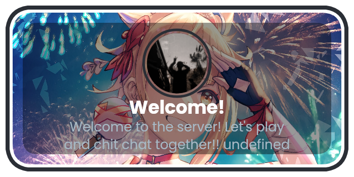
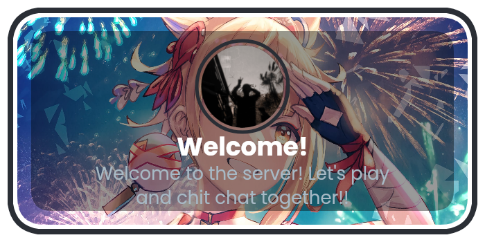

# Discord Welcome Bot

A Discord bot that sends a welcome message and an image with the background and profile picture of a user who joins the server. Built using NodeJS, runs on nodemon

## Features

- Sends a welcome message and image for new members
- Slash command to check the bot's ping and information

## Installation

1. Clone this repository.
    ```
    git clone https://github.com/lrmn7/Discord-Welcome-Bot-V2
    ```  
2. Install the required dependencies 
     ```
     npm install
     ```
3. Configure the bot by adding your bot token and other necessary details to the `config.js` file.
4. Run the bot using 
    ```
    node index.js
    ```
    or by using nodemon
    ```
    nodemon index.js
    ```

## Usage

Once the bot is running and connected to your server, it will automatically send a welcome message and image whenever a new member joins the server. Additionally, you can use the following slash command:

- `/ping`: Check the bot's ping and information.

## Configuration

To configure the bot, you need to provide the following details in the `config.js` file :

- `YOUR_BOT_TOKEN`: Replace with your actual bot token.
- `YOUR_CLIENT_ID`: Replace with your bot's client ID.
- `YOUR_GUILD_ID`: Replace with the ID of the guild (server) where you want to register the slash commands.
- `YOUR_WELCOME_CHANNEL_ID`: Replace with the actual channel ID for the welcome message.

Rest of the configurations can be done according to your wish in the `config.js` file.


## Dependencies

- discord.js: `^13.1.0`
- @discordjs/rest: `^0.1.0`
- discord-api-types: `^9.0.0`
- canvafy: `^5.0.0`
- nodemon: `^2.0.22`

## License

This project is licensed under the MIT License. See the [LICENSE](LICENSE) file for details.
